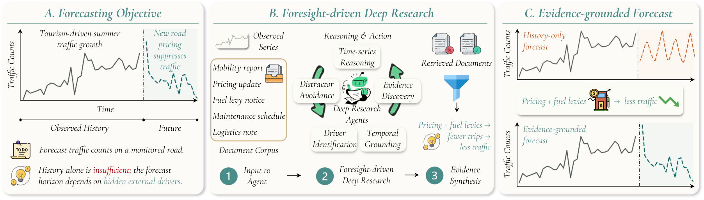
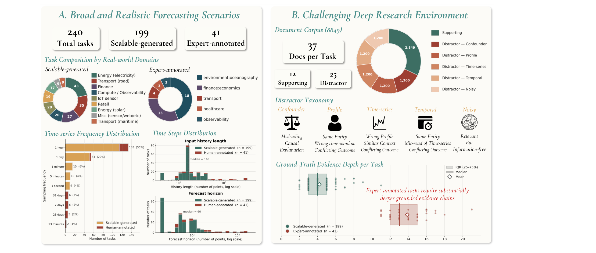

# Dr-CiK: A Testbed for Foresight-Driven Agents

[](https://servicenow.github.io/Dr-CiK/)
[](https://arxiv.org/abs/2605.27904)
[](https://huggingface.co/datasets/ServiceNow/Dr-CiK)
[](https://creativecommons.org/licenses/by/4.0/)

Dr-CiK is a benchmark for evaluating whether agents can **retrieve
forecasting-relevant context from a noisy document corpus, filter out
distractors, distill the retrieved context into forecast-useful evidence, and
produce forecasts grounded in that evidence.**

Real-world time-series forecasting often depends not only on historical
observations but also on external context that must be *actively discovered*
from heterogeneous, noisy information sources. Existing context-aided
forecasting benchmarks typically assume the supporting context is already
provided. Dr-CiK removes that assumption: each task pairs a time series with a
corpus of supporting **and** distractor documents, and the agent must find and
use the right evidence on its own.

> 🌐 **Project page:** <https://servicenow.github.io/Dr-CiK/>
> 📄 **Paper:** <https://arxiv.org/abs/2605.27904>
> 🤗 **Full dataset:** <https://huggingface.co/datasets/ServiceNow/Dr-CiK>



## The task

Each task provides:

- a historical time series and the ground-truth continuation to forecast;
- entity / profile metadata and a target description;
- a corpus of Markdown **documents** — a mix of *supporting* documents (which
  contain the evidence needed to forecast) and *distractor* documents (which do
  not); and
- ground-truth evidence (`gt_evidence`) for evaluation.

An agent must retrieve the supporting documents, reject the distractors,
extract the relevant evidence, and forecast the future values. Every task is
built around a **4-hop** reasoning chain, and each task includes exactly five
distractor documents per distractor subtype (`confounder`, `noisy`,
`timeseries`, `profile`, `temporal`).

## Dataset at a glance

| Item | Count |
| --- | ---: |
| Tasks | 279 |
| Supporting documents | 3,367 |
| Distractor documents | 6,975 |
| Total documents | 10,342 |

Task sources: 199 synthetic, 80 human-authored. The original context-prompt
fields (`background`, `instruction`, `constraints`, `full_text`) are
intentionally excluded from the public release; `gt_evidence` and
`future_values` are retained for evaluation.



<sub>Figure 2 from the paper. The counts shown in the figure (240 tasks / 8,849 documents) reflect the paper's original release; this public release contains **279 tasks / 10,342 documents**.</sub>

## What's in this repository

This repository is the project landing page for Dr-CiK. The **full dataset is
hosted on Hugging Face**; this repo carries a small illustrative sample plus
release metadata.

```text
.
├── README.md
├── LICENSE                     # CC BY 4.0
├── CITATION.cff
├── requirements.txt            # dependencies for the released method
├── requirements_LICENSES.md    # third-party dependency license audit
├── sample/
│   ├── benchmark_manifest.json # metadata for the sampled tasks
│   ├── tasks/                  # 3 example tasks (task_1, task_42, task_201)
│   ├── documents/              # the documents referenced by those tasks
│   └── load_sample.py          # dependency-free reader for the sample
├── docs/                       # static project page (GitHub Pages)
│   ├── index.html              # overview · leaderboard · showcase
│   └── showcase/               # interactive per-task explorer
└── .github/workflows/pages.yml # auto-deploy docs/ to GitHub Pages
```

## Project page

The `docs/` directory is a self-contained static site (no build step, no server,
no API keys) — an overview of the work and motivation, an interactive results
**leaderboard**, and a per-task **showcase**. Preview it locally:

```bash
cd docs && python -m http.server 8000   # then open http://localhost:8000
```

**Deploy to GitHub Pages** (either option):

- **GitHub Actions (recommended):** repo *Settings → Pages → Source: GitHub
  Actions*. The included [`pages.yml`](.github/workflows/pages.yml) workflow
  publishes `docs/` on every push to `main`.
- **Deploy from branch:** repo *Settings → Pages → Source: Deploy from a branch
  → `main` / `docs`*.

The live URL will be `https://<org>.github.io/Dr-CiK/`.

## Quickstart

### Load the full dataset from Hugging Face

```python
from datasets import load_dataset

tasks = load_dataset("ServiceNow/Dr-CiK", "tasks", split="train")
documents = load_dataset("ServiceNow/Dr-CiK", "documents", split="train")
links = load_dataset("ServiceNow/Dr-CiK", "task_documents", split="train")
```

### Explore the bundled sample (no dependencies)

```bash
cd sample
python load_sample.py
```

This prints, for each sample task, the forecast horizon and how its document
corpus splits into supporting vs. distractor documents.

## Schema

Each raw task JSON contains:

- `benchmark_id`, `split`, `origin`, `reasoning_hops`
- `showcase` — entity, profile, and time-series-variable metadata
- `task_metadata` — `frequency`, `prediction_length`, `seasonal_period`,
  `target_description`
- `series` — `history_timestamps`, `history_values`, `future_timestamps`,
  `future_values`
- `documents` — the document corpus, each with `document_id`, `content`,
  `role` (`supporting` / `distractor`), `subtype` (distractor subtype or
  `null`), and `path`
- `annotations.gt_evidence` — ground-truth evidence spans (`{id, evidence}`)

See the [Hugging Face dataset card](https://huggingface.co/datasets/ServiceNow/Dr-CiK)
for the full schema of the normalized `tasks` / `documents` / `task_documents`
configs.

## Requirements

See [`requirements.txt`](requirements.txt). The core dependencies are minimal
(`numpy`, `pandas`, `openai`, `requests`, `tqdm`); a third-party license audit
is provided in [`requirements_LICENSES.md`](requirements_LICENSES.md).

## License

The Dr-CiK benchmark is released under the
[Creative Commons Attribution 4.0 International License (CC BY 4.0)](https://creativecommons.org/licenses/by/4.0/).
See [`LICENSE`](LICENSE).

## Citation

```bibtex
@article{tang2026dr,
  title={Dr-CiK: A Testbed for Foresight-Driven Agents},
  author={Tang, Yihong and Williams, Andrew Robert and Ashok, Arjun and Zheng, Vincent Zhihao and Sun, Lijun and Drouin, Alexandre and Laradji, Issam H and Marcotte, {\'E}tienne and Zantedeschi, Valentina},
  journal={arXiv preprint arXiv:2605.27904},
  year={2026}
}
```

## Contact

For questions about the benchmark, contact Yihong Tang
(<yihong.tang@servicenow.com>) or Valentina Zantedeschi
(<valentina.zantedeschi@servicenow.com>), or open an issue in this repository.

---

Released by [ServiceNow](https://www.servicenow.com) Research.
